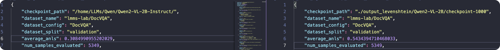

# Strokes
微调一个汉字笔顺的模型

* 首先从国家网站上了解到了再2020年出版的国家规定，数据集从这个规定上提取。
* 编码问题

*上传到服务器上，开始选择模型进行微调*
Strokes环境用来做主任务


环境有些冲突，所以创建另一个基本环境llava-env，用来做llava的Prompt.py测评，避免环境混乱。

```bash
git clone https://github.com/haotian-liu/LLaVA.git

cd LLaVA

pip install -e .

```
详细可以参考这个[链接](https://github.com/haotian-liu/LLaVA.git)

qwen和llava的Prompt结果都查出来了。
接下来可以尝试

***InternVL***

***DeepSeek***

***ChatGPT-4o***


5.11 重写了train_eos.py作为LoRA的版本。调整了超参数为
```Python
r=16,
lora_alpha=32, #一般是2r
lora_dropout=0.05,
```

5.13
train_levenshtein.py
train_levenshtein_lora.py
更新了带levenshtein距离计算的lora和全量微调。
下一步微调lora的超参数，看看到底lora能达到sft的多少程度。

5.15

更新Prompt.py作为Qwen2-VL-2B Instruct 微调前后效果的对比，主要是跑baseline。修改其中的116行，可以调用微调后的模型。

Prompt_llava.py作为llava-1.5-7b-hf的baseline

<font color="grey">两个basemodel测试下来发现效果都很差。</font>


| | Accuracy|
|----------|-----------------|
| Prompt.py(Qwen)   | 0           | 
| Prompt_llava.py| 0|


5.16
Prompt_Qwen_finetune_516.log是微调以后得模型的效果，
Prompt_Qwen_516.log是微调前的模型效果


5.19
train_levenshtein_lora_519.log调整了lora的超参数，看看效果会不会好。


* 尝试用文本大模型，看看微调出来效果如何。

* 评测大模型在微调之后的通用能力有没有下降

7000是最好的那个检查点/home/zsy/GithubCode/Strokes/output_levenshtein/Qwen2-VL-2B/checkpoint-7000

目前是发现通用能力急剧下降，测试一下前面的下降的多不多
这是在微调了很多个epoch以后

<font color = "lightcoral">目前发现一个很困惑的地方就是在微调了5个epoch左右的模型，在MMMU这个benchmark上，以理科为主的学科上，表现提升蛮多的。</font>


| 学科                                  | sft                      | Qwen2-VL-2Binstruct |
|---------------------------------------|--------------------------|---------------------|
| Accounting                            | <font color="green">**36.67%**</font> | 16.67%              |
| Agriculture                           | 33.33%                   | 33.33%              |
| **Architecture\_and\_Engineering** | <font color="green">**27.59%**</font> | 3.45%               |
| Art                                   | 56.67%                   | 56.67%              |
| Art\_Theory                           | <font color="green">**73.33%**</font> | 70.00%              |
| Basic\_Medical\_Science               | 50.00%                   | 50.00%              |
| **Biology** | <font color="green">**37.93%**</font> | 24.14%              |
| **Chemistry** | <font color="green">**26.09%**</font> | 8.70%               |
| Clinical\_Medicine                    | <font color="green">**40.00%**</font> | 36.67%              |
| **Computer\_Science** | <font color="green">**33.33%**</font> | 14.81%              |
| Design                                | <font color="red">**56.67%**</font>  | 63.33%              |
| Diagnostics\_and\_Laboratory\_Medicine | <font color="red">**16.67%**</font>  | 23.33%              |
| Economics                             | <font color="green">**51.72%**</font> | 20.69%              |
| **Electronics** | <font color="green">**37.50%**</font> | 6.25%               |
| **Energy\_and\_Power** | <font color="green">**30.00%**</font> | 0.00%               |
| **Finance** | <font color="green">**22.73%**</font> | 0.00%               |
| Geography                             | <font color="green">**37.04%**</font> | 29.63%              |
| History                               | <font color="red">**50.00%**</font>  | 56.67%              |
| Literature                            | 86.67%                   | 86.67%              |
| Manage                                | <font color="green">**33.33%**</font> | 12.50%              |
| Marketing                             | <font color="green">**27.59%**</font> | 10.34%              |
| **Materials** | <font color="green">**23.33%**</font> | 0.00%               |
| **Math** | <font color="green">**31.03%**</font> | 6.90%               |
| **Mechanical\_Engineering** | <font color="green">**23.33%**</font> | 0.00%               |
| Music                                 | <font color="green">**16.67%**</font> | 13.33%              |
| **Pharmacy** | <font color="green">**48.15%**</font> | 22.22%              |
| **Physics** | <font color="green">**20.69%**</font> | 6.90%               |
| Psychology                            | <font color="green">**44.83%**</font> | 13.79%              |
| Public\_Health                        | <font color="green">**43.33%**</font> | 33.33%              |
| Sociology                             | <font color="green">**50.00%**</font> | 43.33%              |


在$DOC\_VQA_{test}$上表现

发现总正确率也有提升。


---


文本大模型，首先尝试了qwen2vl本身的文本能力，测试集上正确率为1%。验证集上最高2%。

<font color= "lightblue">尝试采用qwen2.5测试，应该效果差不多。</font>

2.5-1.5B-Instruct效果不好啊，指令遵循能力不太行，再训个大的试试。

**swanlab教程：**
```python
from swanlab.integration.transformers import SwanLabCallback
custom_experiment_name = f"train_language_{MODEL_NAME}_{time.strftime('%Y%m%d-%H%M%S')}"

swanlab_callback = SwanLabCallback(
    project=os.environ.get("qwen2.5-7B-Instruct"),  # 使用环境变量中定义的项目名
    workspace=os.environ.get("Shane-Luchi"),  # 使用环境变量中定义的工作空间名
    experiment_name=custom_experiment_name,
    description=f"Fine-tuning {MODEL_NAME} for Levenshtein language task (stroke prediction).",
)
```

解决了torchrun不能运行的问题，但是有弊端，通信速度变慢了，还不如一张卡的速度，只有一半

```bash
CUDA_VISIBLE_DEVICES=0,1 NCCL_P2P_DISABLE=1 nohup torchrun --nproc_per_node=2 train_levenshtein_language.py > logs/train_levenshtein_language_qwen2.5_7B_$(date +%Y%m%d_%H%M%S).log 2>&1 &
```

明天看一下这个7B的效果怎么样
```bash
AVG BLEU Score: 0.20240104343713822
AVG ROUGE Scores: {'rouge-1': 0.8945059270028934, 'rouge-2': 0.49693320680076997, 'rouge-l': 0.8061132031421891}
AVG Levenshtein Distance: 10.403940886699507
Test Accuracy: 0.0099 (4/406)
```